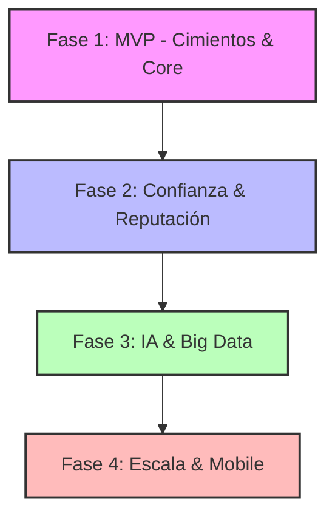

# PLAN DE IMPLEMENTACIÓN PROPTECH: FLUJO POR FASES

Este documento detalla el plan de ejecución técnica y funcional para la plataforma PropTech, estructurado en fases evolutivas para garantizar un control total del desarrollo y una salida al mercado eficiente.

---

## 🏗️ Arquitectura de Referencia (Stack Actualizado)
- **Frontend:** Angular (Última versión) + Tailwind CSS + Angular CDK.
- **Backend:** Java + Spring Boot + Hibernate (JPA).
- **Base de Datos:** PostgreSQL + PostGIS (incluyendo Blob Storage Local).
- **Infraestructura:** AWS (EKS, RDS) + Integraciones S3 solo para Documentos/KYC.

---

## 📈 Flujo General de Implementación

---

## 🟦 Fase 1: MVP - Cimientos y Funcionalidad Core (Meses 1-6)
**Objetivo:** Lanzar un producto funcional con motor de búsqueda y fichas de inmuebles para validar el mercado.

### 1.1 Fundamentos de Infraestructura y Backend (Semanas 1-4)
- **Tarea: Setup de Entorno Cloud**
    - Subtarea: Configuración de VPC y subnets en AWS.
    - Subtarea: Pipeline CI/CD con GitHub Actions para Spring Boot y Angular.
- **Tarea: Arquitectura Base Spring Boot**
    - Subtarea: Implementación de Security con JWT.
    - Subtarea: Diseño de Entidades JPA (User, Property, Listing).
    - Subtarea: Configuración de PostGIS en PostgreSQL.

### 1.2 Core de Gestión de Inmuebles (Semanas 5-12)
- **Tarea: Motor de Publicación**
    - Subtarea: Formulario reactivo en Angular para subida de anuncios con compresión nativa Canvas.
    - Subtarea: Microservicio de gestión de medios (**PostgreSQL LOB Storage**, reemplazando S3 para almacenamiento local de medios).
- **Tarea: Motor de Búsqueda Geoespacial**
    - Subtarea: Implementación de queries espaciales en el Backend (`ST_DWithin`).
    - Subtarea: Integración de Leaflet + OpenStreetMap en el Frontend Angular (migrado de Mapbox).
    - Subtarea: Filtros dinámicos (Precio, Habitaciones, Superficie).
    - Subtarea: Búsqueda por municipio con geocodificación Nominatim (entrada de texto → lat/lng/radio automático). ✅ Completado
    - Subtarea: _(Pendiente Fase 2.1)_ **Búsqueda por zona dibujada** — Dibujo libre de polígono en mapa con `leaflet-draw`; backend acepta GeoJSON polygon vía nuevo endpoint `POST /properties/search` con query PostGIS `ST_Intersects`; diferenciador clave vs Idealista (ver WBS §3.3).
- **Tarea: Formulario de Publicación con Geolocalización**
    - Subtarea: Mapa Leaflet embebido — clic para colocar marcador y capturar lat/lng. ✅ Completado
    - Subtarea: Botón "Mi ubicación" con `navigator.geolocation` + geocodificación inversa Nominatim. ✅ Completado
    - Subtarea: Input de dirección con forward-geocoding (Enter → busca y centra el mapa). ✅ Completado
    - Subtarea: Campos completos: habitaciones, baños, superficie, ascensor, parking, certificado energético. ✅ Completado

### 1.3 Perfiles y Lanzamiento Beta (Semanas 13-24)
- **Tarea: Perfil de Usuario y Scoring Inicial**
    - Subtarea: Módulo de carga segura de documentos.
    - Subtarea: Algoritmo de scoring básico v1.
- **Tarea: Go-Live Localizado**
    - Subtarea: Pruebas de carga (Stress Testing).
    - Subtarea: Onboarding de los primeros 100 usuarios beta.

---

## 🟪 Fase 2: Confianza y Reputación (Meses 7-10)
**Objetivo:** Activar el factor diferencial de la plataforma: la capa de confianza verificada.

### 2.1 Sistema de Verificación Avanzado (KYC)
- **Tarea: Integración de Identidad Biométrica**
    - Subtarea: Conexión con SDK de Onfido/Veriff.
    - Subtarea: Lógica de validación de identidad en el Backend Java.
- **Tarea: Automatización de Solvencia**
    - Subtarea: Integración de OCR para lectura automática de nóminas.
    - Subtarea: Scoring compuesto v2 (Financiero + Identidad).

### 2.2 Motor de Reputación Bidireccional
- **Tarea: Módulo de Reseñas Verificadas**
    - Subtarea: Trigger automático post-contrato para invitar a valorar.
    - Subtarea: Interfaz de gestión de reseñas para propietarios y buscadores.
- **Tarea: Dashboard Propietario v2**
    - Subtarea: Visualización del "Trust Score" de los interesados.
    - Subtarea: Sistema de filtrado automático de leads por rango de score.

---

## 🟩 Fase 3: IA & Big Data (Meses 11-15)
**Objetivo:** Automatización de procesos y democratización de datos de mercado.

### 3.1 Inteligencia Artificial Integrada
- **Tarea: Asistente Conversacional (Claude API)**
    - Subtarea: Chatbot para resolución de dudas sobre inmuebles 24/7.
    - Subtarea: Búsqueda por lenguaje natural (NLP to Query).
- **Tarea: Tasación Inteligente (AVM)**
    - Subtarea: Entrenamiento de modelos con datos de mercado recolectados.
    - Subtarea: Generador de descripciones automáticas para anuncios.

### 3.2 Capa de Datos y Mercado
- **Tarea: Public Big Data Dashboard**
    - Subtarea: Pipeline ETL para procesar tendencias de precios.
    - Subtarea: Mapas de calor (Heatmaps) de oferta/demanda.

---

## 🟥 Fase 4: Escala y Expansión (Meses 16-18)
**Objetivo:** Expansión multiplataforma y crecimiento geográfico.

### 4.1 Ecosistema Mobile y Conectividad
- **Tarea: App Móvil Nativa (React Native)**
    - Subtarea: Adaptación de servicios del Backend para notificaciones Push.
    - Subtarea: Feature de escaneo de documentos móvil.
- **Tarea: API Pública y Partnerships**
    - Subtarea: Documentación Swagger para integración con agencias externas.
    - Subtarea: Módulo de firmas digitales (Signaturit/DocuSign).

### 4.2 Crecimiento Internacional
- **Tarea: Localización y Multi-región**
    - Subtarea: Soporte multi-moneda y normativas legales locales (España/Portugal/LATAM).

---

## 🛠️ Matriz de Control de Riesgos

| Riesgo | Impacto | Mitigación |
| :--- | :--- | :--- |
| **Baja Liquidez (Oferta/Demanda)** | Alto | Foco inicial en una sola ciudad/distrito. |
| **Fraude en Documentación** | Crítico | Implementación obligatoria de KYC biométrico en Fase 2. |
| **Escalabilidad de Base de Datos** | Medio | Optimización de índices PostGIS y uso de réplicas de lectura en RDS. |

---

> **Nota:** Este flujo está diseñado para ser ágil (Agile). Cada fin de sprint en la Fase 1 debe resultar en un incremento de software desplegable en el entorno de Staging.
