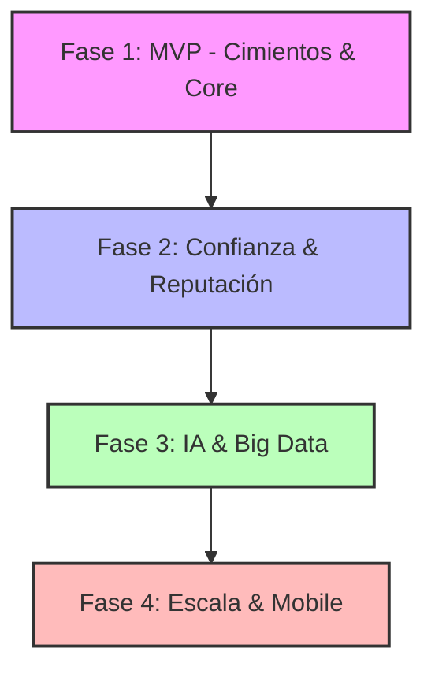

# PLAN DE IMPLEMENTACIÓN PROPTECH: FLUJO POR FASES

Este documento detalla el plan de ejecución técnica y funcional para la plataforma PropTech, estructurado en fases evolutivas para garantizar un control total del desarrollo y una salida al mercado eficiente.

---

## 🏗️ Arquitectura de Referencia (Stack Actualizado)
- **Frontend:** Angular (Última versión) + Tailwind CSS + Angular CDK.
- **Backend:** Java + Spring Boot + Hibernate (JPA).
- **Base de Datos:** PostgreSQL + PostGIS (incluyendo Blob Storage Local).
- **Infraestructura:** AWS (EKS, RDS) + Integraciones S3 solo para Documentos/KYC.

---

## 📈 Flujo General de Implementación

---

## 🟦 Fase 1: MVP - Cimientos y Funcionalidad Core (Meses 1-6)
**Objetivo:** Lanzar un producto funcional con motor de búsqueda avanzado y fichas
de inmuebles para validar el mercado, con capacidades de búsqueda geoespacial
diferenciales respecto a competidores como Idealista.

### 1.1 Fundamentos de Infraestructura y Backend (Semanas 1-4)
- **Tarea: Setup de Entorno Cloud**
    - Subtarea: Pipeline CI/CD con GitHub Actions para Spring Boot y Angular. ✅ Completado

- **Tarea: Arquitectura Base Spring Boot**
    - Subtarea: Implementación de Security con JWT. ✅ Completado
    - Subtarea: Diseño de Entidades JPA (User, Property, Listing). ✅ Completado
    - Subtarea: Configuración de PostGIS en PostgreSQL. ✅ Completado

### 1.2 Core de Gestión de Inmuebles (Semanas 5-12)
- **Tarea: Motor de Publicación**
    - Subtarea: Formulario reactivo en Angular para subida de anuncios con
      compresión nativa Canvas. ✅ Completado
    - Subtarea: Microservicio de gestión de medios (PostgreSQL LOB Storage). ✅ Completado
    - Subtarea: Campos de contexto extendidos — orientación, planta, portero,
      gastos de comunidad, política de mascotas y fumadores. ✅ Completado
    - Subtarea: Detector de calidad del anuncio — puntuación en tiempo real en
      el formulario de publicación (fotos, descripción, campos completados)
      sin dependencias externas. ✅ Completado

- **Tarea: Motor de Búsqueda Geoespacial**
    - Subtarea: Queries espaciales ST_DWithin en backend. ✅ Completado
    - Subtarea: Leaflet + OpenStreetMap (migrado de Mapbox). ✅ Completado
    - Subtarea: Filtros dinámicos (Precio, Habitaciones, Superficie). ✅ Completado
    - Subtarea: Búsqueda por municipio con geocodificación Nominatim. ✅ Completado
    - Subtarea: **Búsqueda por zona dibujada** — polígono libre con `leaflet-draw`
      en el frontend; backend acepta GeoJSON vía `POST /properties/search` con
      query PostGIS `ST_Intersects`. Diferenciador clave vs Idealista.
    - Subtarea: **Selección múltiple de barrios** — importación de polígonos de
      barrios/distritos desde OpenStreetMap con `osm2pgsql`; panel lateral de
      selección múltiple en frontend; reutiliza el mismo endpoint
      `ST_Intersects` de zona dibujada.
    - Subtarea: **Búsqueda por tiempo de desplazamiento (Isócrona)** — integración
      con OpenRouteService API (gratuita, open source); el usuario define un
      punto de origen y tiempo máximo; backend recibe el polígono isócrona en
      GeoJSON y ejecuta `ST_Intersects` contra listings; frontend pinta la zona
      alcanzable en Leaflet.

- **Tarea: Formulario de Publicación con Geolocalización**
    - Subtarea: Mapa Leaflet embebido con clic para capturar lat/lng. ✅ Completado
    - Subtarea: Botón "Mi ubicación" con geocodificación inversa Nominatim. ✅ Completado
    - Subtarea: Input de dirección con forward-geocoding. ✅ Completado
    - Subtarea: Campos completos (habitaciones, baños, superficie, ascensor,
      parking, certificado energético). ✅ Completado

### 1.3 Perfiles, Búsquedas Guardadas y Lanzamiento Beta (Semanas 13-24)
- **Tarea: Perfil de Usuario y Scoring Inicial**
    - Subtarea: Módulo de carga segura de documentos. ✅ Completado
    - Subtarea: Algoritmo de scoring básico v1 (Bronze/Gold/Platinum). ✅ Completado
    - Subtarea: Barra de progreso de perfil — indicador visual del porcentaje
      de completitud del perfil con pasos accionables para el usuario.
    - Subtarea: Vista de compatibilidad — el inquilino ve en cada anuncio si su
      SolvencyScore supera el umbral configurado por el propietario, reduciendo
      contactos irrelevantes para ambas partes.

- **Tarea: Búsquedas Guardadas con Notificaciones**
    - Subtarea: Entidad `SavedSearch` — almacena filtros serializados como JSON
      vinculados al usuario (municipio, zona dibujada, rango de precio,
      habitaciones, etc.).
    - Subtarea: Job programado en Spring (`@Scheduled`) que evalúa búsquedas
      guardadas contra nuevos listings periódicamente y genera alertas.
    - Subtarea: Notificaciones por email en Fase 1; notificaciones push diferidas
      a Fase 4 con la app móvil Ionic.
    - Subtarea: Interfaz de gestión de búsquedas guardadas — el usuario puede
      ver, editar, activar/desactivar y eliminar sus alertas.

- **Tarea: Go-Live Localizado**
    - Subtarea: Pruebas de carga con k6 (p95 < 800ms, error rate < 2%). ✅ Completado
    - Subtarea: Onboarding de los primeros 100 usuarios beta. ✅ Completado
    - Subtarea: GlobalExceptionHandler + RFC 7807 para manejo de errores. ✅ Completado
    - Subtarea: Security hardening (@PreAuthorize, endpoints públicos
      de media). ✅ Completado
---

## 🟪 Fase 2: Confianza y Reputación (Meses 7-10)
**Objetivo:** Activar el factor diferencial de la plataforma: la capa de confianza verificada.

### 2.1 Sistema de Verificación de Solvencia (Sin Retención de Datos)
> El usuario aporta 4 documentos (3 nóminas + contrato de trabajo). El backend 
> los procesa en memoria, extrae únicamente los campos necesarios para validar 
> coherencia, y descarta los documentos. Solo se persiste el score resultante.
> El usuario es informado explícitamente de que ningún documento es almacenado.

- **Tarea: Parser de Documentos In-House (Stateless)**
    - Subtarea: Implementación de extractor de campos con Apache PDFBox en Spring Boot.
    - Subtarea: Motor de regex semánticas para campos clave: nombre, CIF empleador,
      fecha, salario neto/bruto y tipo de contrato — robusto ante distintos layouts
      de software de nóminas (A3, Sage, Meta4, exports Excel).
    - Subtarea: Pipeline de procesamiento en memoria (stream → extracción → descarte);
      ningún documento es escrito a disco ni persistido en base de datos.

- **Tarea: Motor de Coherencia Documental**
    - Subtarea: Validación cruzada de los 4 documentos:
        - Nombre del trabajador idéntico en nóminas y contrato.
        - CIF del empleador consistente entre nóminas y contrato.
        - Secuencia temporal válida (3 nóminas consecutivas y recientes).
        - Antigüedad laboral calculada desde fecha de inicio del contrato.
        - Estabilidad salarial (variación entre nóminas < umbral configurable).
        - Tipo de contrato detectado (indefinido / temporal / obra).

- **Tarea: Scoring de Solvencia v2**
    - Subtarea: Algoritmo de scoring compuesto ponderado con los siguientes factores:
        - Estabilidad de ingresos (variación salarial entre nóminas).
        - Nivel salarial absoluto (ratio salario neto / renta solicitada).
        - Antigüedad laboral (fecha inicio contrato).
        - Tipo de contrato (indefinido > temporal).
        - Coherencia documental global (todos los checks superados = score completo).
    - Subtarea: Persistencia únicamente del score resultante y los metadatos 
      del proceso (fecha de verificación, checks superados/fallados) — sin 
      referencia a los documentos originales.

### 2.2 Motor de Reputación Bidireccional
> Sistema de reputación totalmente bidireccional (propietario ↔ inquilino) basado
> en experiencias verificadas. Genera un ReputationScore independiente del 
> SolvencyScore (2.1). Ambos scores se muestran juntos en el perfil del usuario
> pero se calculan, persisten y filtran de forma separada.

- **Tarea: Módulo de Reseñas Verificadas**
    - Subtarea: Trigger automático por evento con dos niveles de peso:
        - Visita al inmueble confirmada → invitación a valorar (peso 0.3x).
        - Contrato de alquiler firmado → invitación a valorar (peso 1x).
    - Subtarea: Token de valoración de un solo uso con caducidad de 15 días;
      expirado el plazo, el evento no puede valorarse retroactivamente.
    - Subtarea: Sistema de valoración ciego y simultáneo — ninguna parte ve la
      reseña de la otra hasta que ambas hayan valorado o el plazo haya caducado
      (patrón Airbnb), evitando sesgos cruzados.
    - Subtarea: Dimensiones de valoración diferenciadas por rol:
        - Propietario → Inquilino: puntualidad en pagos, cuidado del inmueble,
          comunicación.
        - Inquilino → Propietario: veracidad del anuncio, respuesta ante
          incidencias, trato recibido.
        - Cada dimensión puntúa 1-5; el ReputationScore agrega ponderado
          por peso del evento.
    - Subtarea: Flujo de disputa básico — el usuario puede marcar una reseña
      recibida como incorrecta; gestión manual por soporte en esta fase.
    - Subtarea: Interfaz de gestión de reseñas para propietarios e inquilinos,
      con visibilidad del ReputationScore propio como activo del perfil público.

- **Tarea: Dashboard Propietario v2**
    - Subtarea: Visualización dual por interesado — SolvencyScore y
      ReputationScore mostrados de forma independiente pero conjunta,
      con desglose de factores de cada score.
    - Subtarea: Gestión del estado sin_historial como categoría explícita,
      diferenciada de reputación_baja, para no penalizar a usuarios nuevos
      verificados financieramente.
    - Subtarea: Sistema de filtrado configurable por umbrales independientes
      (ej. SolvencyScore > 70 AND ReputationScore > 60, o solo por solvencia
      ignorando historial para perfiles nuevos).

---
## 🟩 Fase 3: Big Data & Mercado (Meses 11-15)
**Objetivo:** Democratización de datos de mercado combinando fuentes públicas oficiales
con datos propios de la plataforma, ofreciendo valor único e irrepetible para
usuarios y posicionamiento orgánico como herramienta de captación.

> **Nota:** El bloque de Inteligencia Artificial (asistente conversacional, AVM
> y generador de descripciones) queda diferido a una fase posterior cuando el
> volumen de datos propios y la madurez del producto lo justifiquen.

### 3.1 Infraestructura de Datos (Data Layer)
- **Tarea: Pipeline ETL Multi-fuente**
    - Subtarea: Ingesta de fuentes públicas oficiales con cadencias diferenciadas:
        - INE — Índice de precios de alquiler por municipio (actualización trimestral).
        - Catastro OVCCatastro API — valor catastral, superficie y tipología por zona
          (actualización anual).
        - Ministerio de Vivienda — precios medios de alquiler por distrito (CSV,
          actualización trimestral).
    - Subtarea: Ingesta de datos propios de la plataforma (listings, contratos,
      demanda) con actualización diaria.
    - Subtarea: Capa de normalización para homogeneizar esquemas heterogéneos de
      fuentes externas y datos propios antes de la agregación.
    - Subtarea: Tablas de hechos agregados y vistas materializadas en PostgreSQL
      (sin introducir nuevo motor de BD — PostGIS cubre los requisitos geoespaciales
      de esta fase).

- **Tarea: Modelo de Datos del Dashboard**
    - Subtarea: Agregaciones por zona/municipio/distrito y periodo temporal
      (mensual, trimestral, anual).
    - Subtarea: Índices PostGIS optimizados para queries de heatmap geoespacial.
    - Subtarea: Atribución de fuente por cada métrica — distinción explícita entre
      dato oficial externo y dato propio de plataforma (requisito legal y de
      credibilidad).

### 3.2 Dashboard Público Freemium
- **Tarea: Capa Pública (sin registro)**
    - Subtarea: Precio medio de alquiler por distrito/municipio con tendencia
      de los últimos 12 meses.
    - Subtarea: Mapa de calor (heatmap) de oferta activa por zona.
    - Subtarea: Páginas estáticas por zona con estructura de URL optimizada para
      SEO (ej. /mercado/madrid/malasana) — posicionamiento orgánico como
      herramienta de captación desde el primer día.

- **Tarea: Capa Registrada (datos propios exclusivos)**
    - Subtarea: Velocidad de alquiler real — tiempo medio desde publicación
      hasta contrato firmado, por zona.
    - Subtarea: Ratio demanda/oferta real — número de interesados por inmueble
      publicado, por zona y tipología.
    - Subtarea: Precio real de cierre vs precio publicado — diferencial medio
      por zona.
    - Subtarea: SolvencyScore medio por zona — dato único de la plataforma,
      irrepetible por competidores, como indicador de la calidad del demandante
      en cada mercado local.

---

## 🟥 Fase 4: Escala y Expansión (Meses 16-18)
**Objetivo:** Expansión multiplataforma y crecimiento geográfico progresivo,
comenzando por Portugal como primer mercado internacional antes de abordar LATAM.

### 4.1 App Móvil (Ionic + Angular)
> Reutilización del codebase Angular existente mediante Ionic Framework +
> Capacitor como bridge nativo. Un único codebase para iOS y Android.

- **Tarea: Adaptación del Backend para Móvil**
    - Subtarea: Integración de notificaciones push con FCM (Android) y APNs
      (iOS) mediante @capacitor/push-notifications.
    - Subtarea: Revisión y optimización de endpoints REST para consumo móvil
      (paginación, payloads ligeros, caché).

- **Tarea: App Ionic + Angular**
    - Subtarea: Configuración de Capacitor y generación de proyectos iOS/Android
      desde el codebase Angular existente.
    - Subtarea: Escaneo de documentos móvil — integración de
      capacitor-document-scanner con detección automática de bordes para
      el flujo de verificación de solvencia (2.1).
    - Subtarea: Almacenamiento seguro de tokens JWT en dispositivo mediante
      @capacitor-community/secure-storage.
    - Subtarea: Adaptación de vistas Angular a layout móvil con Ionic Components
      (navegación, gestos, formularios táctiles).

### 4.2 API Pública y Partnerships
- **Tarea: Apertura de API para Agencias Externas**
    - Subtarea: Documentación Swagger/OpenAPI de endpoints públicos para
      integración con agencias inmobiliarias externas.
    - Subtarea: Sistema de API keys con rate limiting y scopes de acceso
      por tipo de partner.

### 4.3 Crecimiento Internacional
- **Tarea: Portugal — Primer Mercado Internacional**
    - Subtarea: Adaptación legal del flujo de solvencia (2.1) a documentación
      portuguesa (formatos de nómina y contrato bajo Lei do Arrendamento Urbano).
    - Subtarea: Soporte de NIF portugués en el modelo de usuario.
    - Subtarea: Localización de textos y adaptación de normativa de arrendamiento
      local en los flujos de contrato.

- **Tarea: LATAM — Planificación (no implementación)**
    - Subtarea: Análisis de mercados prioritarios (México, Colombia) —
      normativa local, documentación de solvencia equivalente y viabilidad
      del modelo de scoring.
    - Subtarea: Diseño de arquitectura multi-región y multi-moneda como
      preparación para Fase 5.

---

## 🛠️ Matriz de Control de Riesgos

| Riesgo | Impacto | Mitigación |
| :--- | :--- | :--- |
| **Baja Liquidez (Oferta/Demanda)** | Alto | Foco inicial en una sola ciudad/distrito. |
| **Fraude en Documentación** | Crítico | Implementación obligatoria de KYC biométrico en Fase 2. |
| **Escalabilidad de Base de Datos** | Medio | Optimización de índices PostGIS y uso de réplicas de lectura en RDS. |

---

> **Nota:** Este flujo está diseñado para ser ágil (Agile). Cada fin de sprint en la Fase 1 debe resultar en un incremento de software desplegable en el entorno de Staging.
